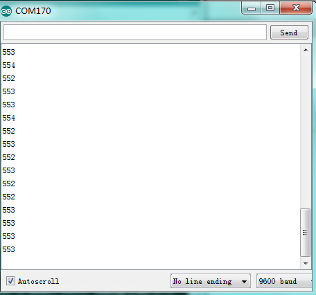

# Arduino


## 1. Arduino简介  

Arduino是一种开源电子原型平台，广泛用于电子项目和互动设计。自2005年发布以来，Arduino因其简单易用、多样化的硬件和软件工具而受到工程师、艺术家和学生的欢迎。Arduino的核心是一个微控制器，它通过各种输入（如传感器）和输出（如电机、LED等）与环境交互。使用Arduino，用户可以轻松编程并创建各种创意项目，如自动化系统、机器人和艺术装置。Arduino IDE（集成开发环境）为用户提供了直观的编程界面，支持基于C/C++的编程语言，适合所有技能层次的开发者。  

## 2. 连接图  

  

## 3. 测试代码  

```cpp  
int sensorPin = A0; // 定义模拟口A0  
int value = 0; // 设置value为0  

void setup() {  
    Serial.begin(9600); // 设置波特率  
}  

void loop() {  
    value = analogRead(sensorPin); // 将value设置为读取到的A0的数值  
    Serial.println(value, DEC); // 显示value数值，并自动换行  
    delay(50); // 延迟0.05S  
}  
```  

## 4. 测试结果  

按照上图接好线，烧录好代码，上电后，我们可以在软件的串口监视器中看到相应的模拟值，如下图所示。声音越大，模拟值越大。  




