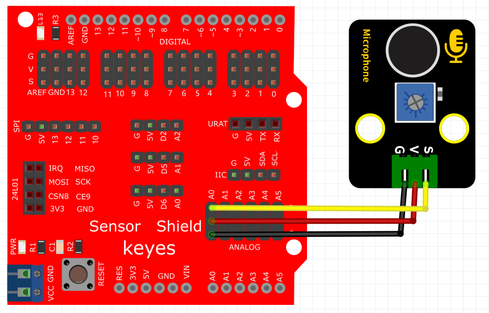

# KidsBlock

## 1. KidsBlock简介  

KidsBlock是一款针对儿童和初学者的图形化编程工具，旨在通过简单易用的拖放界面让用户轻松学习编程。KidsBlock允许用户将编程逻辑以积木式的形式进行配置，无需了解复杂的编程语言。该工具支持与Arduino平台及其他硬件的集成，使得用户能够快速上手，进行各种电子和互动项目的开发，如传感器应用、机器人等。KidsBlock通过可视化编程的方式，提高了编程的趣味性和可操作性，使得学习变得更加轻松和愉快，为学生的逻辑思维和创造力提供了良好的训练平台。  

## 2. 连接图  

  

## 3. 测试代码  

1. 在事件栏里拖出Arduino启动模块。  

     

2. 在串口栏拖出设置串口波特率模块并设置波特率为9600；然后在引脚栏拖出设置引脚模块，设置引脚为A0，模式为输入。  

     

3. 在控制栏拖出重复执行模块。  

     

4. 在串口栏拖出串口打印模块，并添加引脚栏里的读取模拟引脚A0的模块在里面；最后添加一个延时为50ms的延时模块。  

     

## 4. 测试结果  

按照上图接好线，烧录好代码，上电后，我们可以在软件的串口监视器中看到对应的模拟值，如下图所示。声音越大，模拟值越大。  

