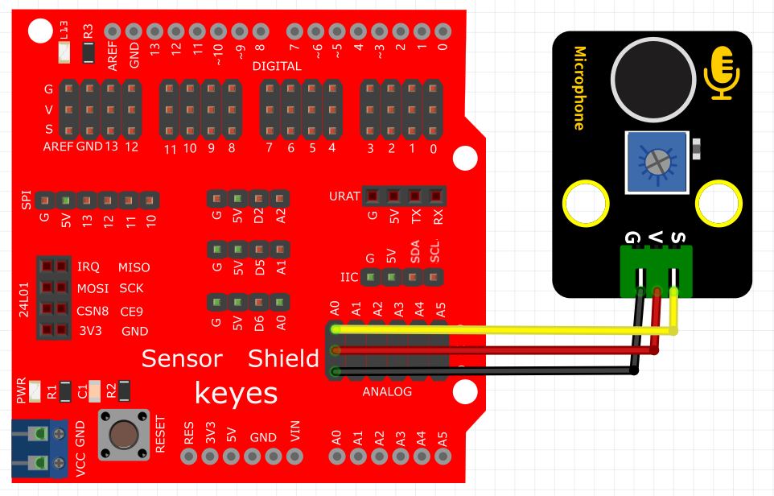
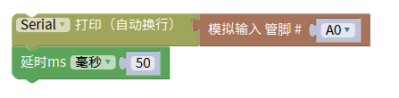
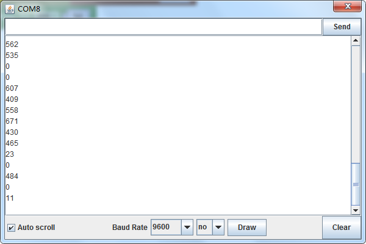

# Mixly

## 1. Mixly简介  

Mixly是一款以可视化编程为基础的图形化编程工具，特别适合儿童和编程初学者使用。用户可以通过拖放编程模块，直观地创建程序，而无需深入学习复杂的编程语言。Mixly支持Arduino平台，并通过模块化的设计，简化了编程流程，使得用户能够更轻松地进行硬件控制和项目开发。该工具提供多种编程语言的支持，包括C、Mixly图形编程以及Scratch，方便用户根据自身需求选择合适的编程方式。Mixly的出现为学习编程提供了更为亲切和有趣的方式，鼓励用户尝试各种创意项目，如机器人、传感器应用等。  

## 2. 连接图  

  

## 3. 测试代码  

  

## 4. 测试结果  

按照上图接好线，烧录好代码，上电后，我们可以在软件的串口监视器中看到相应的模拟值，如下图所示。声音越大，模拟值越大。  

