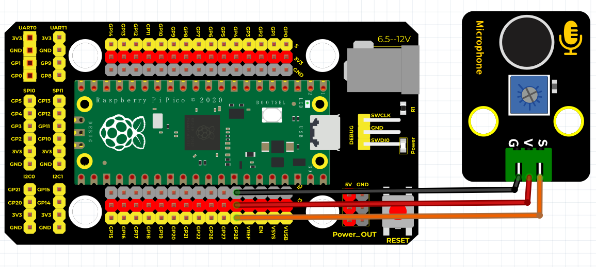
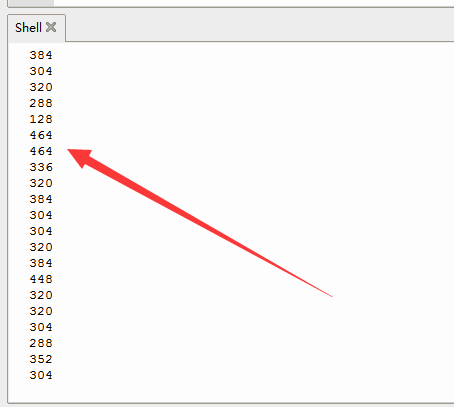

# Python


## 1. Python简介  

Python是一种广泛使用的高级编程语言，因其清晰的语法和简便的学习曲线而备受欢迎。自1991年发布以来，Python在数据科学、人工智能、Web开发和自动化等领域取得了显著的成就。Python支持多种编程范式，包括面向对象、函数式和结构化编程。它拥有丰富的标准库和第三方库，能够帮助开发者快速实现各种功能。由于其易于阅读和维护的特点，Python也常常作为教学语言，帮助初学者建立编程基础。  

## 2. 连接图  

  

## 3. 测试代码  

```python  
import machine  
import utime  

sensorPin = machine.ADC(28)  # 设置28脚为模拟输入脚  

while True:  
    reading = sensorPin.read_u16()  # 读取模拟脚的模拟值  
    print(reading)  # 打印模拟值  
    utime.sleep_ms(50)  # 延时50ms  
```  

## 4. 测试结果  

按照上图接好线，烧录好代码，上电后，我们可以在软件的串口监视器中看到相应的模拟值，如下图所示。声音越大，模拟值越大。  




